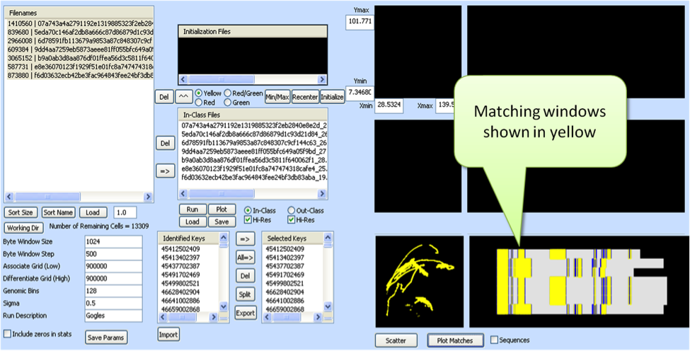
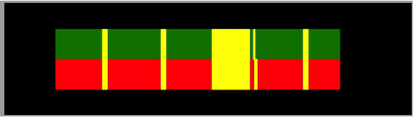
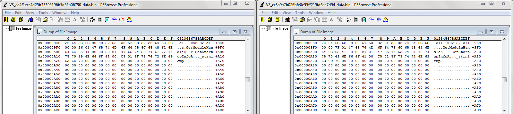
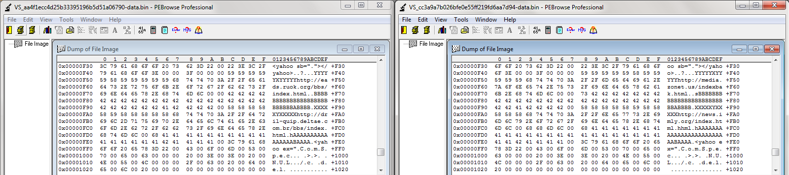
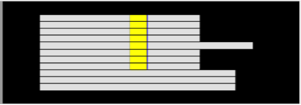
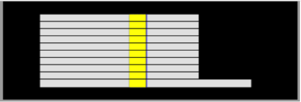

# A Critical Review of Spatial Analysis

## Abstract

Spatial Analysis is a technique for graphing statistical features of binary artifacts for use in obtaining visual information about the structural similarities between the artifacts.  The binary artifacts are typically malware samples, but may be files of any sort.  They are treated as static byte sequences, and the features are fused and graphed onto 2-D grids, with the resulting visualization spatially locating their similarities.  The visualizations are generated using simple sliding windows moving along the byte sequences of a file and calculating statistical features. These features are used to determine matches of highly similar but not necessarily exact byte sequences whose features map them into grid cell regions, indicating “nearness.”  These byte sequences are then used to generate detector algorithms for fast and scalable discovery of family relationships among large artifact collections.  The ability to identify malware family members based on byte sequence similarity could prove invaluable as a quick assessment tool for analysts. We examine the validity of some assumptions Spatial Analysis makes to determine the merit to approach and present our initial findings.

# Explanation of the tool

BAT (Byte Assessment Tool) is a malware analysis tool developed by the Sentar R&D team.  BAT is an implementation of Spatial Analysis [^1] [^2]. BAT accepts digital artifacts of any type (exe, dll, png, etc…), in any quantity, and asks the user to initialize using two of the artifacts.  BAT converts these two files into two sets of byte windows, computes the running mean and sigma of the byte windows and compares them to each other, graphically displays matching windows in yellow or differing windows in red/green.  BAT displays each artifact horizontally, byte zero on the right and the last byte on the left, stacking them vertically.  From here BAT encodes the matching byte window mean and sigma into keys and can allow the user to export a detector that can search for these keys.  The detector reports artifacts containing the keys, and the user can examine each further.  The detector takes in running mode, step size, folder to run against and folder to store results.

# Experiment

For this experiment we used the now famous APT1 data set published by Mandiant[^3]. In their report, the Mandiant team details what it considers to be malware families?  In this experiment we will look at the Yahoo family data sections. We will test the null hypothesis—that is, we will try to disprove Spatial Analysis via BAT by examining its results when compared to PEBrowse[^4] and the information about the Yahoo family provided by Mandiant.

| Full Name (MD5 + Sentar Convention) | Short Name | 
|:-------|:---------|
| vs_aa4f1ecc4d25b33395196b5d51a06790-data.bin | aa4f1 |
| vs_cc3a9a7b026bfe0e55ff219fd6aa7d94-data.bin | cc3a9 |
| vs_a8f259bb36e00d124963cfa9b86f502e-data.bin | a8f25 |
| vs_f7f85d7f628ce62d1d8f7b39d8940472-data.bin | f7f85 | 
| vs_7a670d13d4d014169c4080328b8feb86-data.bin | 7a670 |
| vs_37ddd3d72ead03c7518f5d47650c8572-data.bin | 37ddd |
| vs_0149b7bd7218aab4e257d28469fddb0d-data.bin | 0149b |
| vs_1415eb8519d13328091cc5c76a624e3d-data.bin | 1415e |
| vs_4c9c9dbf388a8d81d8cfb4d2fc05f8e4-data.bin | 4c9c9 |
| vs_2b659d71ae168e774faaf38db30f4a84-data.bin | 2b659 | 

| Inputs | Settings | Description |
|:-------|---------:|:------------|
| Byte Window | 512| The amount of bytes in a window |
| Associate Grid | 9000 | The initial grouping resolution used to increase sensitivity |
| Differentiate Grid | 900000 | The final projecting of features used to increase specificity resolution |
| Genomic Bins | 128 | Number of columns the artifacts are broken into for graphical bitmask display |
| Sigma | 3.0 | Used to zoom in on the graphics |

Below is the graphical result from BAT after being initialized on two samples from the Yahoo family. Sample aa4f1 is represented as the green horizontal stripe, and sample cc3a9 is shown as the red horizontal stripe; the yellow highlights are matching code/data/strings via bytes or in this case, data.  Notice that the yellow highlights closely align.

Now let’s compare these results with those from PEBrowse.  The largest yellow stripe (the block roughly in the middle) starts at offset 2541 or hex 0x09ED in both samples, so let’s look at that location in PEBrowse:

As shown, samples aa4f1 and cc3a9 in PEBrowse have almost identical values starting at the highlighted offset.  Line 0x9F0 and 0xA00 contain two single differences, an “&” and a “P” respectively.  

Now let’s look at an area of supposedly non-matching data, after the last yellow stripe is at offset 3888 or in hex 0xF30:

It’s clear that, although similar, the two different URLs on lines 0xF50 and 0xFA0 make this area a lot less similar than the yellow areas, and when BAT displays yellow the samples do indeed have similar bytes, or in this case data.  

Now let’s examine the detector feature of BAT.  We exported a detector based on the keys from the initialization samples and ran it against the entire APT1 set, 288 samples.  We ran the detector set for full file scan mode, step size 200, and 1 for the offsets to be put in binary form.

The detector identified the following samples as having keys matching the training samples.

| Name | Truth |
|:-------|:---------|
| vs_1c16bd1488162c03cd506c2f71486a0f-data.bin | Unknown |
| 2b659 | Yahoo by Mandiant | 
| 4c9c9 | Yahoo by Mandiant | 
| vs_5c6f20cc269cd164d44941d381e3283cc-data.bin | Unknown | 
| 7a670 | Yahoo by Mandiant | 
| 36d5c | Yahoo by Mandiant | 
| 37ddd | Yahoo by Mandiant | 
| a8f25 | Yahoo by Mandiant | 
| aa5f1 | Yahoo by Mandiant; Trained on | 
| cc3a9 | Yahoo by Mandiant; Trained on | 
| vs_d16947b200afa74a917f055597b772c0-data.bin | Unknown | 

There are two problems with these results.   First, the detector failed to identify three samples (f7f85, 0149b, and 1415e) the Mandiant report identified as members of the Yahoo family, and second, we believe the unknown samples are false positives as they are not listed in the Yahoo family.

Let’s look at the samples Mandiant declared as members of the Yahoo family. In the picture below, the three samples not found by the detector are completely grey, indicating no shared bytes. Note the picture was edited to show delineation between samples.

The way BAT displays results allows the user to begin to see patterns or structures of shared bytes at similar offsets in the sample.  As we can see above, blocks of yellow in each sample form columns with each additional matching sample.  In this case the lack of structure or shared data indicates samples f7f85, 0149b, and 1415e are not proper members of Yahoo by shared data.

## The second problem

We took ten of the eleven samples identified by the detector and examined them with BAT.  (The eleventh sample was too large to display with the other samples)  The picture below shows all ten share consistently structured data. Note the picture was edited to show delineation between samples.

After examining these ten, we went back and looked at the omitted sample separately and found it too shared the same consistent amount of data forming the same structure.

# Conclusion

When referring to malware people often use the word “family,” but what does that mean?  In the case of Mandiant the word family means those observed to have similar behavior, meta data, and observations during reverse engineering.  With Spatial analysis we can use the word family to also mean shared byte sequences.  The techniques used by analyst today are time honored, examine each piece of malware for its behavior, meta data and reverse engineer it; however, this is difficult, time consuming, and increasingly improbable.

Our experiments show that the idea of spatial analysis is a sound one.  Spatial analysis gives the analyst the ability to easily classify malware into groups based on shared bytes and thereby reduce the amount of malware that must be observed and reverse engineered.   The graphical display highlights similar structures that can be used to identify other matching artifacts.  Spatial analysis brings out the strengths in the analyst and the computer by allowing the analyst to observe patterns in structure of malware and the computer to now examine malware at the byte level.   

## References

* [^1] H. M. Jaenisch, J. Handley, and D. Williams, "Digital microArray analysis for digital artifact genomics," Proceedings of the SPIE, vol. 8757, 2013.
* [^2] H. M. Jaenisch. (2010). Digital virus recognition - http://spie.org/x40459.xml?ArticleID=x40459
* [^3] MANDIANT. (2010). M-trends: The Advanced Persistent Threat - http://www.princeton.edu/~yctwo/files/readings/M-Trends.pdf
* [^4] SmidgeonSoft. (2013). Windows Programming Utilities - http://www.smidgeonsoft.prohosting.com/

#### Metadata

Tags: Visual Malware Analysis, Spatial Analysis, Byte Sequences, Statistical Features

**Primary Author Name**: David Giametta  
**Primary Author Affiliation**: Sentar, Inc.  
**Primary Author Email**: davidgiametta@gmail.com  

**Additional Author Name**: Andrew Potter  
**Additional Author Affiliation**: Sentar, Inc.  
**Additional Author Email**: andrew.potter@sentar.com  