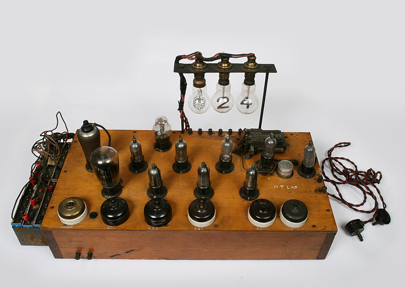

# “How I Met Your Mother” or The Brief and Secret History of Bletchley Park and How They Invented Cryptography and the Computer Age

## Preface

Nikola Tesla died, cold and alone. Having brought the world together with radio, emancipated hordes of laborers with the electric motor, and turned off the dark with AC transmission, the man who worked out the great puzzles of the 20th Century in his head, without an education, lied dead and forgotten in a cheap hotel until his body was discovered by the housekeeper. This is 1943, cheated by Edison, robbed by Westinghouse, denied the Nobel Prize, reversed on 645,576 without explanation, the most transformative minds of his time, buried alive by greed and graft. This is not his story.

The World was at War: Tesla's visions were being used like never before: electricity to power the great engines of war, and radio to transmit the voice of Edward Murrow from an orchestrated hell. The Tesla Oscillator of 1900 was appropriated by Marconi and soon permitted wireless communication across the oceans and between continents; the job of securing these communications fell to elite mathematicians, and the job of **unravelling** those messages fell to the even more elite:

## Germany

In 1517, Martin Luther nails a thesis and releases the full text of the Holy Bible on the internet, or the equivalent of the internet in 1517 - the **vernacular** - prior to which the peasants were controlled by the largest institutions of their time, one kept the secrets and records on everyone - the other a gallows. He was of course, excommunicated and declared an outlaw. For all that, Luther was quite intolerant of people who refused to convert, and his vocal anti semitism was certainly a foreshadowing, if not a cause of things to come...

Germany found its way into the 20th Century, not unlike the United States, newly unified after a “recent unpleasantness” under Otto von Bismarck, who, having survived a quite similar near assassination, carved out a modern civilization in Germany. Like Qin, who unified China by standardizing its language in 256 B.C., Bismarck unified Germany by **standardizing its religion**. At that time, religion was more of a territorial marker, like the Pledge of Allegiance, than a statement of personal faith. An admirer of Luther, Bismarck launched his own **KultureKampf** against the Catholic church - significantly reducing the influence of Rome. Bismarck also introduced Europe to the modern social contract - with pensions for the elderly, accident, medical, and unemployment insurance. While the old Germany was a dichotomy of landed gentry and peasants, a new Germany emerged in the 20th century with a jump on public education, a rising middle class, social cohesion, entrepreneurism et al., and quickly became a dominant economic force. The First World War was largely an effort by France and Britain to contain the rising power of a new and unified Germany. Crushed by WWI, and again by the Great Depression, the center fell, and Germany was handed over to the Nazis in a plurality election along its historical fault lines: nationalism, lutheranism, anti-semitism, and religious unification.

I touch on this only to bring us to 1943, Like the United States, Germany is struggling to throw off the distant empire (Rome), and create a more powerful Union - and does so by resurrecting their Ghandi, their Washington: Martin Luther, and his ageless complaint against the corruption of absolute and infallible power. Religion had dominated private and public life for the last thousand years, and while the west had thrown off the shackles of a state church, Germany was cinching the knot with Luther.

## Pre-War Poland

The Poles were treated as undesirables by Germany at least since Bismarck, and that animosity explains at least in part, the motivation of Polish mathematicians to monitor and understand the encryption technologies developed over the border. Not only was the Polish cryptography unit excellent cryptanalysts, who discovered the new mappings, and other changes in the Enigma machine from it’s commercially available version to it’s military edition; but they made the first critical step towards the modern digital computer* - they built an electromechanical device to rotate the wheels on a simulated enigma machine, and conduct a logical test on each wheel position when the crank is turned. Contrast that with the German cryptanalysts who wandered around the theatres attached to various units and began and ended the war with pencil and paper. Konrad Zuse, who invented the Z1, an electromechanical computer, spent the war living essentially in his parents basement, while England, after being tipped off by the Poles, recruited the best mathematicians and scientists of the day along with hundreds of supporting WRENS to a single site north of London where they decoded the war, and invented the computer, in secret.

## Enigma and Lorenz

The Germans used two main ciphers during the war, one, the Enigma is portable but slow, and used for tactical communications in the battle theatre. Encryption is by means of 26 electrical paths which pass through a series of spinning rotors, reflectors and patch cables. Interceptions of the enigma messages had the form of Morse code, The Lorenz cipher is far more sophisticated as it reads and writes a Baudot tape, which can be automatically fed into a transmitter, and automatically produced by the receiver. It was used by High Command to communicate strategic messages with forward bases. Encryption is by means of passing the values of five detectors through two rows of wheels which invert the value or not depending on a series of notches around each wheel. The Lorenz messages when intercepted were captured as binary inflection of a pen on a moving tape and interpreted manually by trained WRENS. While the Enigma messages were broken right from the outset, the Lorenz messages remained obscure until a lucky break, when a message tape broke during transmission, and a new tape of the same message was retyped - with a considerable number of additional abbreviations - and resent with the same message codes. Such a message is said to be “in depth”, and it is possible to work out both messages simply by finding the one key character for each position which produces a valid word in both messages for the same position.

## Ever Increasing Complexity

Starting in 1938, the Enigma was altered to increase its complexity, and each time, the team at Bletchley Park headed by Alan Turing, responded by increasing the complexity of the cryptographic bombs.  A significant change - the addition of a Fourth rotor - created the need to implement the fastest rotor in exotic tubes rather the more reliable relay logic. The team brought in to develop the tube logic included Wynn-Williams, who in 1930 had invented a vacuum tube counter for research in nuclear physics.

## Heath Robinson

With the interception of a rare message in depth, and the success of the high speed tube modules, Bletchley Park set out to crack the Lorenz cipher with an unprecedented assemblage of vacuum tubes. The math is straightforward, the device will be an event counter, triggered every time all or part of the baudot code is the same as the code above it. The Machine has two sets of optical readers, one for the key and one for the message, and each set has two rows, the current character and the previous character. The logic level combines the key with the message (xor) and compares the outputs of the two characters for similarity (Also xor). This is effective because the incidence of repeated characters in the plain text is higher than random text; a phenomena which is evidenced by counting any of the five baudot bitstreams in isolation or in combinations of a few bit streams. The first machine is a massive collection of wheels and tubes, with a tendency to break the key tape in a percussive event akin to movie film when it breaks during a rewind - much deserving of the moniker: Heath Robinson - the British equivalent of Rube Goldberg.

## 1943 A Golden Age

Tommy Flowers realizes the solution is to eliminate the key wheel, and the sprockets which wear out the tape. Max Newman, and the others think the idea too complicated to work, but Flowers goes back to his office at British Telecom with determination, and spends 11 months with a team of 50, to rebuild it bigger and better. Gone is the keytape; all of its complexity subsumed in a bank of counting valves, gone is the sprockets which wear out the message tapes before they complete their 4000 cycles, and gone are the double row of optical readers - replaced by a shift register which remembers the prior character. Add to that a filter to ignore improbable results, some switches to adjust the logical test, and a conditional branching circuit that pauses the message advancement if the printer is busy when the next count is ready.

The first Colossus is delivered in December, the upgrade with 5 parallel counters and a shift register, allows the Colossus Mark II to analyse 5 message positions in a single round. The Lorenz cipher is broken with regularity for the remainder of the war. Perhaps more importantly, Britain has its first genius bar, a group of people, sworn to secrecy, who know how to build computers. These are the Werner von Braun's of the Computer, powerful and dangerous men who brought new ideas into the world in its darkest hour.

## Post War

Churchill's orders after the war are to destroy the Colossus, and he appears to have included Turing in the bargain. The United States has fallen into Mccarthyism, Gays and Communists are the new enemy, and it is the United States who encouraged England to purge itself of the gay.

Gays were more likely to defect from countries that tried them as criminals, it was argued, and so they tried Turing for buggery, and after undergoing chemical castration, one of the leading experts in a leading field of science, driven from his profession, hounded by gaybashing spooks, tortured by the crown, buried alive, Turing died, with not even himself for company, a single bite missing from an apple, reminiscent of the couplet he was heard to quote;

> Dip the apple in the brew  
> Let the sleeping Death seep through.[^1]

This is his story.

We don’t know how he came to die - only why - a persistent government obsession with crushing such individuals. Turing recent pardon only underscores the brutality of the McCarthy years.

Throughout History, The penalty for those who open our collective eyes to d around understanding of the Universe, the World around us, Ourselves, disrupting the establishment, are constantly individualized, targeted, marginalized, exiled, excommunicated, imprisoned or killed - usually by some anonymous irrational institution. We don’t know the name of the prosecutor who sent Turing to an early grave. We ought to: such should not go quietly into the night.

Wired has an excellent article about the protracted persecution of scientists - often by a church - from Galileo to Turing[^2]. What about now? Aaron Swartz died last year, crushed by Prosecutor Carmen Ortiz for what? Releasing the findings of tax funded research?

## Cost of Spying

The Snowden case is more delicate - clearly he broke a law by disclosing what the NSA has done - but many people and the courts now agree[^3], the government appears to have committed criminal espionage on it’s own people - evoking the spectre of the KGB. The cost of one nuclear accident: Chernobyl, in 1989, erased all the economic gains that came from the soviet use of nuclear power. How do we measure the value of espionage, and compare it to the foreign policy costs of losing the moral high ground to the communists - whom we so loudly accused of spying on their own people? The 2001 Nobel Prize in Economics[^4] recognized the importance of Information Asymmetry in both contract theory and economics - in short - if the people you’re trading stocks with have better information than you do - they’ll win and you’ll lose. What is the effect on the dollar denominated economy if traders come to realize that the NSA permits[^5] of US workers access to information that it steals from buried fiber, RSA backdoors, Tapping Cellphone and the like? If Trust is the product; what then the cost of the NSA spying on the everyday activities of its own citizenry? If there is a way to ensure that this level of internal espionage won’t be abused - certainly the NSA has demonstrated it cannot be trusted.

What can we learn from our History? Perhaps that government overreach between wars can be as cruel and unforgiving on some as the wars themselves are on others?

## Afterward

I come to this history, not as a historian, but as a mathematician: 2 years ago, Bob Weiss[a] and I began exploring the cryptanalysis of the Enigma machine, along the way we found that most of the of the 4 or 5 simulators online - including the emulator on Bletchley Park’s own website -  are flawed and incoherent, we won a dinner bet with the NSA (ok, an employee) on the effect of the steckerbrett, we found two weaknesses and built a massively parallel Enigma simulation for gpu to exploit them. That research was presented at 44con during the Turing Centenery, and while in London, we visited Bletchley Park, the Enigma Bombs, and the Colossus machine - which immediately intrigued me, in part because the frequency attack was closer to what we were doing with the Enigma than the Bombe which is a known plaintext attack. The Colossus is a single bucket frequency counter - not quite the chi squared frequency distribution test we use; but the elements are there, and I wanted to dig a bit deeper.

## References

* [^1] http://www.polarimagazine.com/features/killing-alan-turing/, Written by Christopher Bryant
* [^2] http://www.wired.co.uk/news/archive/2012-06/21/scientists-persecuted-turing
* [^3] http://www.nytimes.com/2014/01/02/opinion/edward-snowden-whistle-blower.html?_r=0
* [^4] http://money.cnn.com/2001/10/10/economy/nobel/
* [^5] http://www.wired.com/threatlevel/2012/07/security-clearances-increasing/

