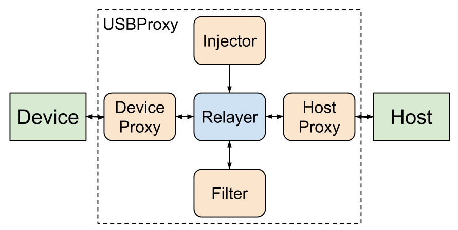

# USBProxy
### An Open and Affordable USB Man in the Middle Device

## Abstract
The past few years have seen a surge of interest in USB security with projects such as Travis Goodspeed's FaceDancer and Nicolas Boichat's USBSniffer. We present USBProxy, an open framework for monitoring, injecting and modifying USB packets in real time.

USBProxy has been designed for use with the BeagleBone Black, making it cheap and easy for any researcher or hobbyist to investigate USB communications. The BeagleBone Black also allows us to operate at USB 2.0 Hi-Speed.

## Introduction

USB is the most ubiquitous interface for consumer technologies, with 2 billion devices sold each year. So it is unsurprising that USB security is becoming the focus of more and more research, including driver exploitation on host systems, device firmware security and the connection in between.

There are many tools available for USB investigation, but most of them have limitations that prevent a full audit of USB systems. In the spirit of Wright's Law[^1]

>Security will not get better until tools for practical exploration of the attack surface are made available

We present USBProxy[^2], a USB man in the middle tool designed for the BeagleBone Black or any hardware capable of running Linux and supporting USB device mode. USBProxy is open source, compatible with very low cost hardware and does not suffer from the limitations of other USB proxy or emulation tools.

We have worked hard to make sure that USBProxy uses as few system resources as possible, while being flexible by allowing third party extensions through a simple plugin system.

## Background

USBProxy is certainly not the first USB man in the middle or device spoofing tool for USB. As part of Google Summer of Code 2010, Nicolas Boichat created a kernel module and tool named USBSniffer[^3] that allowed the BeagleBoard xM to pass through USB traffic and monitor it with USBMon. Unfortunately the USBSniffer required maintenance to keep in line with the kernel, which has not happened, so it no longer builds against modern kernels.

In 2012 Travis Goodspeend designed FaceDancer[^4] which combines a Maxim Integrated MAX3421E USB peripheral IC with a GoodFET device to allow USB devices prototyped in Python to be connected to a host. FaceDancer has been popular among the information security industry, but it has some limitations which we would like to avoid, such as a maximum of two endpoints and a 1Mbps data rate, although this was improved by RaspDancer[^5] and BeagleDancer[^6].

USBProxy is built on top of an existing kernel module which provides us with stability and the opportunity to be agnostic about the underlying hardware. We have no limitations on number of endpoints or speed other than those imposed by the processor or USB interface.

## USBProxy

USBProxy is an open source C++ framework that makes it easy to monitor, inject and modify USB packets in transit. To achieve this we use a BeagleBone Black[^7] running Debian Linux to act as a proxy or man-in-the-middle device. We chose the BeagleBone Black because it is cheap, widely available, open source hardware and powerful enough for our uses, but USBProxy should work on any Linux system that supports USB device mode.

We chose to use gadgetfs[^8] to connect to host systems rather than developing our own kernel module because we can be sure that it will be maintained in line with kernel development. We understand that the convenience that gadgetfs provides is a trade off against performance, but we believe that it is a worthwhile trade to make for most uses.

The USBProxy code consists of two parts, a relayer and a set of plugins. The relayer is used to pass packets from a host, through user defined filters, to the target device. The relayer makes up the core library part of the USBProxy code.

There are four plugin categories: host proxies, device proxies, filters and injectors. The proxies are used to communicate with external hosts or devices through gadgetfs and libusb. There are also proxies that relay packets via a TCP/IP connection, allowing devices to be used remotely while appearing to be locally connected.

Filters are used to read and modify packets in transit. Some filters log packets without modification, while others can be used to filter unwanted packets or modify the content. For example filters exist to log keystrokes from a USB keyboard or dump all USB packets in pcap format so that they can be imported in to Wireshark[^9].

The final set of plugins allow packets to be injected in to the connection, such as keystrokes being added or inserting unexpected audio.

Extending USBProxy
------------------

From the beginning of the project we wanted to make it as easy as possible to
extend the basic functionality that we have written. Any user should be able to
write their own plugins.

A filter plugin is as simple as writing two functions that handle packets and
control requests.

    filter_packet(Packet)
    filter_setup_packet(SetupPacket, direction)

An injector only needs to expose a file descriptor from which injected packets
can be read.

Device proxy plugins can be used to prototype future devices; they only require
device descriptors and functions to handle reading and writing of endpoints.
This allows developers to begin writing drivers and host applications before
devices have been produced.

    send_data(endpoint, attributes, maxPacketSize, dataptr, length)
    receive_data(endpoint, attributes, maxPacketSize, dataptr, length, timeout)

Plugins also allow bindings to be written for different languages. We have begun
this work with a Python device plugin, which we hope will support existing
FaceDancer applications.

Future Work
-----------

We plan to implement full FaceDancer software compatibility so that exiting
tools[10] can be used unmodified with USBProxy.

We have not yet identified any systems with USB 3.0 capabilities that support
gadgetfs, but we intend to support Daisho[11] as soon as possible.

Acknowledgements
----------------

We would like to thank Travis Goodspeed and Sergey Bratus for their work on
FaceDancer. We would also like to thank Daiki Ueno for libusb-gadget, which was
a very useful reference for dealing with gadgetfs.

## References

* [^1] Wright's Law, Joshua Wright, http://code.google.com/p/zigbee-security
* [^2] USBProxy, https://github.com/dominicgs/USBProxy
* [^3] USBSniffer, Nicholas Boichat, http://www.elinux.org/BeagleBoard/GSoC/2010_Projects/USBSniffer
* [^4] FaceDancer, Travis Goodspeed, Sergey Bratus, http://goodfet.sourceforge.net/hardware/facedancer21
* [^5] RaspDancer, Philippe Teuwen, http://wiki.yobi.be/wiki/Raspdancer
* [^6] BeagleDancer, Dominic Spill, https://github.com/dominicgs/BeagleDancer
* [^7] BeagleBone Black, http://beagleboard.org/products/beaglebone%20black
* [^8] GadgetFS, http://www.linux-usb.org/gadget
* [^9] ExtCap, Mike Kershaw, Mike Ryan, Sharkfest, 2013, http://sharkfest.wireshark.org/sharkfest.13/presentations/NAP-11_Expanding-Wireshark-Beyond-Ethernet-and-Network-Interfaces_Kershaw-Ryan.pdf
* [^10] umap - the USB host security assessment tool, David, NCC Group, https://github.com/nccgroup/umap
* [^11] Daisho, https://github.com/mossmann/daisho

#### Metadata
Tags: USB, man-in-the-middle, open source

**Primary Author Name**: Dominic Spill  
**Primary Author Affiliation**: Great Scott Gadgets  
**Primary Author Email**: dominicgs@gmail.com  
**Additional Author Name**: Adam Stasiak