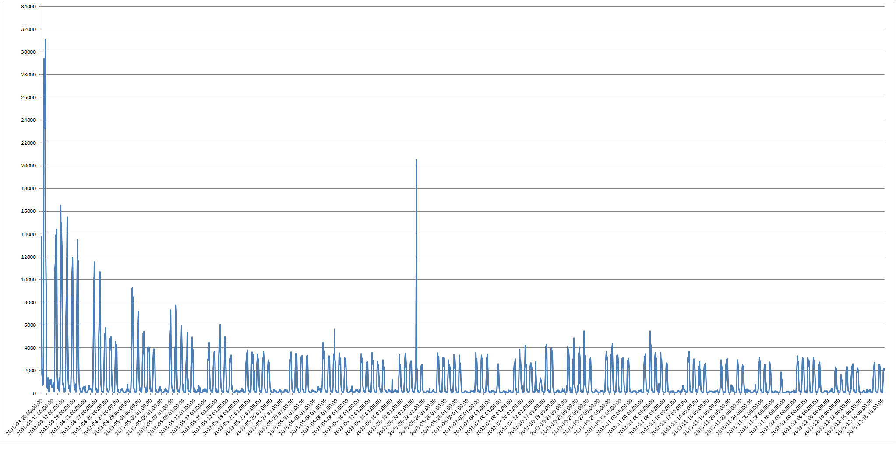
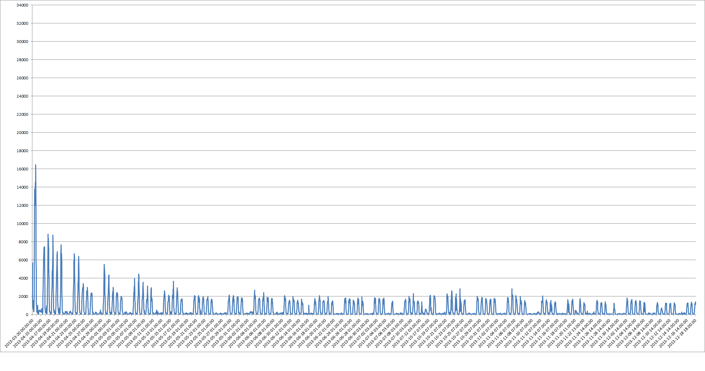

# Security Analytics
### More Data, Less Hype

## Abstract

There has been a lot of talk in the industry recently about "analytics" and getting security data from non-security logs. The problem is, very few people are talking about which analysis techniques are actually useful. This talk will look at a few log types and talk through analytics techniques that can be applied to each. For each technique, I'll talk about what it assumes and how it succeeds or fails when using real-world data. This is (obviously) not going to cover every single analysis technique you could ever run, but it is intended to start bringing facts and real-life data to the discussion of security analytics. 

## What're we doing here?

Analytics has become a big subject of discussion in the security community over the past few years. However, few people talk about false positive rates, detection rates, etc., when talking about security analytics. I have tried a few techniques to see how they work with real life data, and will share the results from two sources of data: DNS and Webmail. Both sets of logs were collected over a 5-6 month period from an organization with ~40,000 users. 

## DNS Model #1: Anomaly Detection

### Are new domains inherently suspicious?

This came from a SANS handler's diary entry[^1]: can you do DNS anomaly detection by collecting all DNS requests, establishing a baseline, and treating any new DNS zones as inherently suspicious? 

Assumptions: 

1. Your attacker is using a domain your users haven't looked up before. 
2. Your users mostly go to the same domains over and over. 

Results: if you graph the number of new domains looked up per hour, you get:

This follows the expected pattern: a big initial spike that falls off to a steady state. However, steady state is 2,500 new domains per *hour*. That's far too high to allow you to investigate all of them. (note: the spike in the middle is also a false positive.) This false positive rate is at least 99%.

Does this work if you look at second level domains (google.com), rather than hostnames (mail.google.com)? That looks like:

The final baseline in this case is still over 1,000 new domains per hour, which is still too high. This false positive rate is still 99%. In both cases, malicious domains were detected and flagged, but they were buried in noise. 

Assumption #2 is wrong.

You can salvage success for this technique. I did that two ways:

1. Check the new hostnames report against a DNS reputation list. This had a very low false positive rate (the same rate as the watchlist itself), and only triggered on 3-4 lookups per day.

2. The data can be used to build a passive DNS database, which is very valuable for incident response.

## DNS Model #2: Rate of new names

### Do users have a predictable rate at which they go to new places?

Can you model the rate at which users look up new names & does a hacked system show up with a different rate? 

Assumptions:

1. Users have a predictable rate of looking up new names.

2. A compromised system will look up more names than a regular user would.

3. Host IPs will be somewhat stable in the face of DHCP. 
 
I allowed each IP 30 days for a baseline to determine the average rate (with standard deviation) each host looked up new names, then flagged when the IP went 3 sigma past that average.

Results: 5,700 hits. DHCP in some subnets is clearly moving hosts around, but even excluding those subnets (excluded subnets where > 30 hosts hit), 3,100 hosts still hit. I asked some users what triggered their spikes: people had forwarded them links, they'd returned from a long weekend/vacation/etc. False positive rate again north of 99%.

Assumption #1 is wrong.

## Webmail Model #1: Known systems and locations

### Do users actually use the laptops we issue?

This technique builds on the gmail/facebook alerts about previous browsers/locations that have logged into your account. Do those actually work, and can they be used in a corporate environment to flag compromised accounts? I collected a 30-day baseline of the ASNs (i.e. the originating ISP) of the source IPs used in a webmail session and the browser User-agents used to log in. After the baseline period, when a new connection came in with new ASN and new User-agent, that was flagged as suspicious. 

Assumptions:
  
 1. Users have a limited number of systems they log in with, and that they take one of them with them on vacation.
 2. Updates to user's browser will tend to happen when they're at work/home, not on vacation.

Results: 6,300 hits in 5 months, from over 5,000 unique users in over 1,200 different new ASNs. Again, false positive rate > 99%. Compromised accounts were correctly flagged, but those results are buried in noise. 

Assumption #1 is wrong.

Some success can be salvaged from this one also: get the travel schedule of of the organization's VIPs and compare with the results of this model for just the VIP accounts. False positives may still occur, but it's far more practical to get the travel plans of 100-ish VIPs than 40,000 users. (~130 VIPs caused 31 flagged connections over 5 months, but all were explained as travel.)

## Webmail Model #2: This is an ex-Condorde ##
### You can't move faster than sound...can you? ###

If we geolocate the IPs used to log into webmail, can we flag as suspicious sessions that require the user to move faster than the speed of sound to get between the two locations? 

Assumptions:

 1. Users don't VPN (or only to our VPN systems, not to random places on the net).
 2. Geolocation is accurate enough to base speed calculations on.
    
Results: 76 hits over 5 months, with ~60% false positive rate. Some false positives from partner organizations' VPNs, but those are easy to identify and exempt. This technique also flagged behavior that wasn't flagged anywhere else (users sharing passwords with outside entities). Not perfect, but very interesting, and surprisingly effective. 

## Conclusions ##

 1. Assumptions are dangerous.
 2. Getting a good signal/noise ratio is *hard*.
 3. Success most often came from cross-correlating other information like reputation lists, travel schedules.

## References

[^1] https://isc.sans.edu/forums/diary/A+Poor+Man+s+DNS+Anomaly+Detection+Script/13918

#### Metadata

Tags: Analytics, DNS, Webmail

**Primary Author Name**: Aaron Gee-Clough  
**Primary Author Email**: aaron@g-clef.net  
**Primary Author Bio**: Aaron Gee-Clough bailed out on grad school for the .com boom and has been doing security for about 14 years. He also thinks bios are kinda dumb, since you all don't really care anyway. (But, if you insist, several years ago he hacked the ShmooCon Arcade's point display system. He never did get around to using the video card he "won" from that.)
